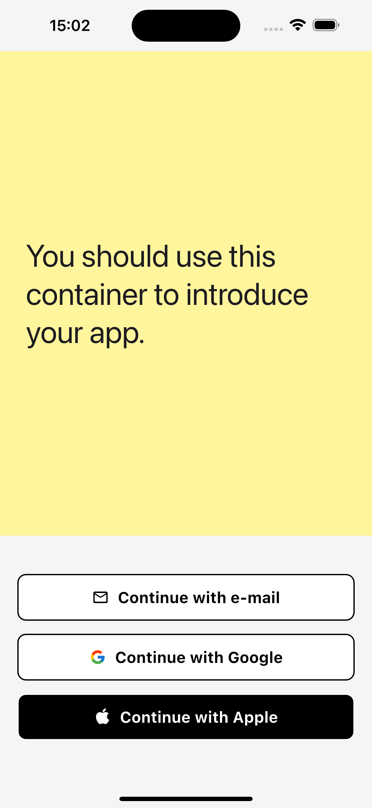

# Fluo

**User Onboarding for Flutter**



## Getting started

**STEP 1** — Get an api key from the [Fluo dashboard](https://dashboard.fluo.dev/signup).

**STEP 2** — Add the package to your dependencies:

```bash
flutter pub add fluo
```

## Usage

Add the `FluoOnboarding` component at the root of your app:

```dart
import 'package:fluo/fluo_onboarding.dart';
import 'package:fluo/l10n/fluo_localizations.dart';
import 'package:fluo/theme.dart';
import 'package:flutter/material.dart';

void main() {
  runApp(const ExampleApp());
}

class ExampleApp extends StatelessWidget {
  const ExampleApp({super.key});

  @override
  Widget build(BuildContext context) {
    return MaterialApp(
      localizationsDelegates: const [
        // ...other delegates...
        FluoLocalizations.delegate,
      ],
      supportedLocales: FluoLocalizations.supportedLocales,
      theme: FluoTheme.defaultTheme(context, FluoTheme.lightColorScheme),
      home: FluoOnboarding(
        apiKey: 'your-api-key',
        onUserReady: (fluo) async {
          // You're done! Persist the 'fluo' instance and use it to
          // get an access token when needed:
          // final accessToken = await fluo.getAccessToken();
        },
        child: Center(
          child: Text(
            'Welcome',
            style: Theme.of(context).textTheme.headlineLarge,
          ),
        ),
      ),
    );
  }
}
```

Always use `getAccessToken` to get a _fresh_ access token:

```dart
// Example of a server request
void _onUpdateFirstName(String firstName) async {
  final accessToken = await fluo.getAccessToken();
  await apiClient.updateUser(
    accessToken: accessToken,
    firstName: firstName,
  );
}
```

## Advanced topics

### Theming

The `FluoTheme` can be extended as shown below:

```dart
import 'package:fluo/theme.dart';
import 'package:flutter/material.dart';

class ExampleAppTheme {
  static ThemeData defaultTheme(BuildContext context) {
    final colorScheme = ColorScheme.light(
      surface: Colors.white,
      onSurface: Colors.black,
      surfaceContainer: Colors.white24,
      primary: Colors.black,
      onPrimary: Colors.white,
      secondary: Colors.black45,
      error: Colors.red.shade400,
    );

    final fluoTheme = FluoTheme.defaultTheme(context, colorScheme);
    final fluoExtended = fluoTheme.copyWith(
      colorScheme: colorScheme,
      textTheme: fluoTheme.textTheme.copyWith(
        headlineLarge: fluoTheme.textTheme.headlineLarge?.copyWith(
          fontSize: 60,
          fontWeight: FontWeight.w700,
          height: 1,
          letterSpacing: -2,
        ),
        displaySmall: fluoTheme.textTheme.displaySmall?.copyWith(
          fontSize: 40,
          fontWeight: FontWeight.w700,
          height: 1,
          letterSpacing: -1,
        ),
      ),
    );
    return fluoExtended;
  }
}
```
